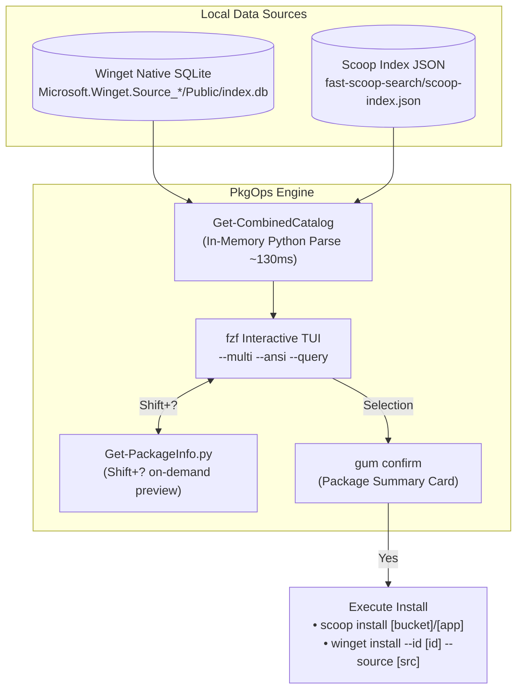

# PkgOps (Package Operations)

A modern, high-performance package management module for PowerShell on Windows. It combines **Winget** and **Scoop** into a unified, interactive terminal interface powered by [Charm Gum](https://github.com/charmbracelet/gum) and [fzf](https://github.com/junegunn/fzf).

---

## Highlights

- **Complete Catalog Browsing**: Running `Install-Packages` without arguments instantly opens `fzf` with over **20,000+ packages** (from both Winget and Scoop) ready for real-time fuzzy filtering.
- **Sub-Second Native Cache**: Directly reads Scoop's local `scoop-index.json` and Winget's native local SQLite database (`Microsoft.Winget.Source_*\Public\index.db`) in memory (~130ms), with zero background scraping daemons or slow network lookups.
- **Zero-Guessing Installation**: Scoop packages preserve their exact bucket (`extras/tor-browser` -> `scoop install extras/tor-browser`), and Winget packages preserve their exact source (`winget install --id ... --source winget`).
- **Interactive Info Preview (`Shift+?`)**: Pressing `Shift+?` (or `?`) in `fzf` toggles an on-demand preview pane displaying full metadata, licenses, homepages, and dependencies.
- **Smart Uninstaller**: `Uninstall-Packages` concurrently queries installed packages across both Winget and Scoop. If multiple packages match a query, it launches `fzf`; if exactly one package matches, it prompts for immediate confirmation.
- **System Update Pipeline**: `Update-AllPackages` automates updates for Winget sources, Winget packages, Scoop apps, UV Python tools, and local Git repositories.

---

## Prerequisites

Ensure the following tools are installed and accessible in your `PATH`:

| Dependency | Purpose | Recommended Installation |
|---|---|---|
| **PowerShell 7+** | Core runtime engine (`ForEach-Object -Parallel`) | Pre-installed / `winget install Microsoft.PowerShell` |
| **fzf** | Interactive fuzzy finder & multi-selection TUI | `scoop install fzf` |
| **gum** | Modern terminal cards, banners, and confirmation dialogs | `scoop install charm-gum` or `winget install charmbracelet.gum` |
| **python** | Sub-millisecond SQLite index parser and preview runner | `scoop install python` |
| **fast-scoop-search** | Local indexer for Scoop buckets (`scoop-index.json`) | Placed in `$HOME\Git\fast-scoop-search` |

---

## Commands & Usage

### 1. `Install-Packages`

Unified command for searching, browsing, and installing packages.

```powershell
# 1. Open full catalog in fzf (~20,000 packages)
Install-Packages

# 2. Open fzf pre-filtered to a specific query
Install-Packages neovim

# 3. Update sources first (both Winget and Scoop), then open fzf
Install-Packages -Update
Install-Packages tor -Update

# 4. Direct install (bypasses fzf when explicit prefixes are provided)
Install-Packages scoop:extras/tor-browser winget:Neovim.Neovim
```

#### Keyboard Shortcuts in `fzf`:
- **Type**: Filter across package names, IDs, buckets, and sources in real-time.
- `<Tab>`: Toggle multi-select package(s).
- `<Shift-Tab>`: Move up while toggling selection.
- `Shift+?` (or `?`): Toggle the metadata preview pane on the right.
- `<Enter>`: Proceed to install all selected packages.
- `<Esc>` / `<Ctrl-c>`: Abort without installing.

---

### 2. `Uninstall-Packages`

Intelligently queries your actual installed applications across both package managers.

```powershell
# 1. Open fzf displaying all currently installed programs
Uninstall-Packages

# 2. Search installed packages by name
#    - If multiple match (e.g. 'tor' matching tor-browser & qBittorrent): opens fzf pre-filtered.
#    - If exactly one matches (e.g. 'tor-browser'): asks for immediate confirmation.
Uninstall-Packages tor

# 3. Direct uninstallation (skips search)
Uninstall-Packages scoop:tor-browser
Uninstall-Packages winget:Notepad++.Notepad++

# 4. Bypass confirmation dialogs
Uninstall-Packages scoop:tor-browser -Force
```

---

### 3. `Update-AllPackages`

Executes a full, visually styled system maintenance pipeline:

```powershell
Update-AllPackages
```

**Pipeline Stages:**
1. Updates Winget sources and upgrades AppInstaller binary.
2. Upgrades all installed Winget packages (`winget upgrade --all`).
3. Updates Scoop buckets, upgrades all Scoop apps, and triggers `fast-scoop-search` reindexing.
4. Upgrades all global Python tools managed by UV (`uv tool upgrade --all`).
5. Pulls latest changes for configured Git repositories (`Pull-GitRepos.ps1`).
6. Removes unwanted shortcut `.lnk` icons from Desktop (`Remove-DesktopIcons`).

---

## Architecture & Data Flow



---

## File Structure

```
shell/pwsh/modules/PkgOps/
├── PkgOps.psm1          # Core PowerShell module containing all cmdlets
├── Get-PackageInfo.py   # High-speed preview helper invoked by fzf on Shift+?
└── README.md            # Module documentation
```
